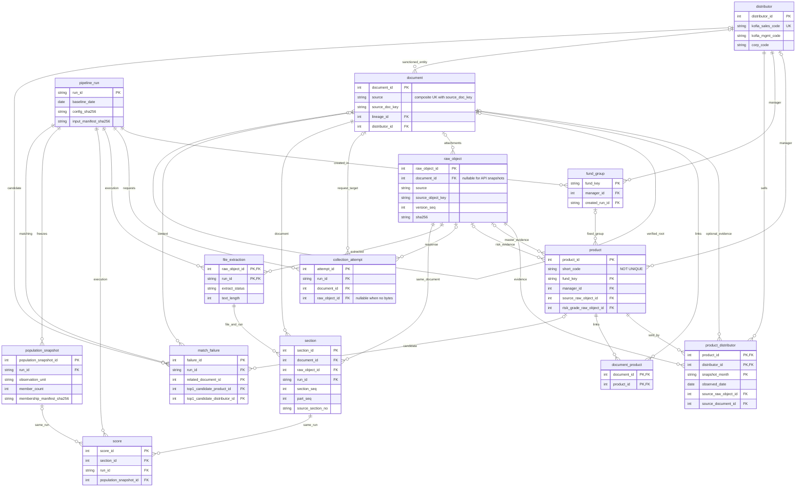

# 01. 논리 스키마·ERD — 2026-09-22 재검토안

이 문서는 `schema.dbml`과 함께 현재 설계안을 정의한다. 검토 근거·원천 자료형·수정 이유·미결 사항은 [18_schema_review.md](18_schema_review.md)에 있다.

**상태**: 09-20 팀 결정(run_id 통일, fund_key 고정, 비교 모집단 별도 표)을 구조로 옮기고 실제 데이터와 충돌하는 제약을 수정한 **검토안**이다. 신규 칼럼명·자료형·제약의 09-30 팀 승인이나 DS의 09-30 인계 승인이 끝났다는 뜻은 아니다. DB 제품·물리 DDL·인덱스 튜닝·decimal 정밀도는 이번 범위에서 확정하지 않는다.

## 1. 표 목록과 한 행의 의미

| 표 | 한 행의 단위 | 역할 |
|---|---|---|
| fund_group | 고정된 펀드 묶음 하나 | 이름 변경에도 유지되는 fund_key의 발급·조회 기준 |
| product | 상품 클래스 하나의 현재 마스터 | 단축코드·표준코드·상품명·현재 분류 |
| distributor | 법인 하나 | 운용사·판매사·겸업을 같은 법인으로 관리 |
| product_distributor | 상품 × 판매사 × 월 | 월 대표 판매관계와 실제 조회일·원천 파일 |
| document | 소스 안의 공고·접수·게시글 하나 | 소스별 문서 식별과 확인된 정정 계보 |
| document_product | 문서 × 상품 | 다대다 연결의 근거·방법·점수 |
| raw_object | 저장한 응답/첨부 바이트의 한 버전 | 문서 파일뿐 아니라 상품/KRX/API 목록 원본 |
| collection_attempt | 실행 안의 요청 한 번 | 파일이 없는 타임아웃, 정상 0건, 재시도도 기록 |
| pipeline_run | 논리 실행 하나 | 기준일·파서·산식·입력 스냅숏을 한 번호로 고정 |
| file_extraction | 원본 파일 × 실행 | 실행별 추출 상태와 전체 텍스트 |
| section | 파일·실행 안의 실제 구간 하나 | 원문 부/절·요약과 정확한 위치 |
| score | 실행 × 절 × 점수유형 | 절 점수. 산식 변경 시 새 실행 |
| population_snapshot | 실행 안의 비교 층 하나 | 비교 정의·건수·실제 구성원 스냅숏 |
| match_failure | 매칭 시도 하나 | 상품/법인 후보·실패 사유·해결 기록 |

기존 9개 표에 **fund_group, collection_attempt, pipeline_run, file_extraction, population_snapshot**을 더해 14개다. 앞의 셋을 모두 raw_object에 합치면 각각 상품 묶음·요청·실행 단위가 파일 단위와 충돌하고, 실행별 추출 결과가 없으면 과거 절을 재현할 수 없다. 설계 대안과 비용은 18의 ADR에 기록했다.

## 2. 상품과 법인

### 상품 product / 펀드 묶음 fund_group

- PK는 내부 `product_id`. **short_code는 UNIQUE가 아니다.** 코드가 같은 후보가 여러 개이면 전체 코드·운용사·클래스를 대조하고 해소되지 않으면 `AMBIGUOUS`로 남긴다. `standard_code`의 전역 유일성도 이번 표본만으로 강제하지 않는다.
- `short_code`는 문자열 5자리, `kofia_fund_code`와 `standard_code`는 각각 문자열 12자리다. K55와 KR5/KRM을 섞지 않는다. 단축코드는 DART 표지 또는 포털 `srtnCd` 원문을 사용한다.
- `product_name`은 포털 `fndNm`, `inception_date`는 포털 `setpDt`, `source_baseline_date`는 `basDt`다. `setpDt`는 설정일이지 판매개시일이 아니다.
- 포털에는 운용사 필드가 없어 `manager_id`는 연결 전 NULL을 허용한다. 등록 사실을 잃지 않되 운용사/펀드 묶음 미확정 행을 비교 모집단에 몰래 넣지 않는다.
- `fund_key`는 `fund_group`의 고정 서러게이트 FK다. 신규 클래스는 기존 묶음을 먼저 찾고, 없을 때만 새 번호를 발급한다. 모자 구분·호수·유형을 보존하고 클래스 표기만 제거한다. 이름 변경 때 재발급하지 않는다.
- `fund_group.canonical_name`은 UNIQUE가 아니다. 동일한 이름의 모/자 펀드나 다른 회차를 강제로 합치지 않는다. 이름 변경 대응은 실행 입력 manifest의 매칭 근거로 보존하고, 대규모 별칭 이력 관리가 필요하면 Gate B에서 확장한다.
- `risk_grade`는 1~6 또는 NULL. DART 표지와 금투협 첨부를 모두 근거로 사용할 수 있으나 충돌 시 임의 선택하지 않는다. 현재 값의 근거는 `risk_grade_raw_object_id`; 과거 값은 실행 입력 manifest에 고정한다.
- `sale_start_date`·`sale_end_date`는 확인된 날짜만 저장한다. 날짜 미상은 판매 중 확정이 아니다. 후보 범위와 확인 범위는 [06](06_original_vs_correction.md)을 따른다.
- `is_public_offering`도 근거 없으면 NULL. 미상·사모·공모를 같은 값으로 접지 않는다.
- `valid_from/valid_to`는 기존 SCD 예비 칸이다. 현재 PK 하나로 SCD2 여러 행을 저장할 수 있는 것은 아니다. 버전 PK 설계 전까지 현재 마스터와 불변 실행 입력 manifest로 분리한다.

| etf_confidence | is_etf | product_category | 비교 모집단 |
|---|---|---|---|
| KRX_CONFIRMED | true | ETF | 나머지 자격 충족 시 포함 |
| NOT_ETF | false | 확인된 펀드/ELS | 펀드는 자격 충족 시 포함, ELS는 CDI 제외 |
| NAME_ONLY | NULL | NULL | 이름 기반 후보이므로 제외 |
| PENDING | NULL | NULL | 판정 보류로 제외 |

NOT_ETF는 비ETF 확인 근거가 있을 때만 쓴다. KRX 미매칭 또는 이름에 「상장지수」가 없다는 사실만으로 비ETF를 확정하지 않는다. ELS 식별 키·발행사 모델은 Phase 2 미정이며 NULL 허용이 ELS 적재 완료를 뜻하지 않는다.

### 법인 distributor / 판매관계 product_distributor

| 항목 | 규칙 |
|---|---|
| kofia_sales_code | `saleCompCd`, 표본 200건의 6자리 유일 문자열. 운용사 코드와 별개 |
| kofia_mgmt_code | 금투협 운용사 코드 3자리. `corp_code`와 대응 검증 필요 |
| corp_code | DART 제출 법인 코드. 코드를 숫자로 바꿔 선행 0을 잃지 않는다 |
| distributor_type | 운용사 / 판매사 / 겸업 / 미상. 상품 manager는 운용사·겸업만 |
| 판매관계 PK | `(product_id, distributor_id, snapshot_month)` |
| observed_date | 실제 펀드 목록 조회 기준일. 월만 기록해 조회일을 잃지 않는다 |
| source_raw_object_id | 판매사별 펀드 API 응답 파일 FK. 항상 비어 있던 source_document_id를 보완 |

월별 동일 대표일의 **완료된 조회 결과**만 판매관계 스냅숏으로 채택한다. 같은 월의 임의 여러 날짜 결과를 합집합으로 넣으면 월말 판매관계도 특정 날짜 판매관계도 아니다. 재조회 내용이 달라지면 원본 버전을 보존하고 사용한 버전을 실행 manifest로 고정한다. 일별 판매관계가 필요하면 PK를 일 단위로 바꾸는 별도 결정이 필요하다.

`document.corp_code`는 제출자, `document.distributor_id`는 제재 대상 법인이므로 두 역할을 혼동하지 않는다. ETF 판매관계가 표본에 없다는 것은 관측 불가이며 「판매사가 없는 상품」이라는 뜻은 아니다.

## 3. 문서와 소스별 키

문서의 유일키는 **`(source, source_doc_key)`**다. 소스가 다른 같은 숫자 ID가 충돌하지 않는다. 해시를 쓰는 경우 해시 생성 전 원천 필드를 `source_key_payload`에 JSON으로 남긴다.

| source | source_doc_key | 주의 |
|---|---|---|
| dart | rcept_no 문자열 | 접수번호와 파일 바이트 버전은 다르다 |
| kofia_disclosure | companyCd, standardDt, announceTtl, tmpV1의 정규 JSON 배열을 SHA-256 | 수시공시만 4필드로 묶음. ZZZZZZ를 지우지 않음 |
| fss_sanction / fss_improvement | examMgmtNo, emOpenSeq, transCode, actGbn의 정규 JSON 배열을 SHA-256 **(후보)** | emOpenNo는 저장 표본 8/8 공백. 후보 4필드는 8/8 유일하나 전수 안정성은 미확인 |
| fss_dispute | 게시판 ID + 게시글 번호 | 게시판 이름공간 포함 |

제재 후보키 구성 필드가 비었거나 같은 키에서 서로 다른 레코드가 발견되면 raw에 보존하고 문서 병합을 보류한다. 원문·응답 순번을 보존해 검수한다. API와 게시판의 같은 사건을 자동 합치지 않는다. `emOpenNo`는 원천 payload에 남겨 향후 코드 복원에 대비한다.

- `source_record_payload`에 제재 원천 13필드 등을 보존한다. `action_date=actReqDate`, `source_input_at=inputDate`이며 분석 사건일과 증분 수집일을 구분한다.
- `received_date`는 공시/게시 날짜다. DART 접수일, 금투협 공고일, 제재 inputDate의 날짜, 분쟁 게시일로 매핑한다. 검증 불가 레코드는 raw에서 대기한다.
- `is_correction`은 true/false/NULL이다. 금투협 규칙 미정이나 DART 구조를 읽지 못한 경우 NULL. `lineage_id`도 미확정·원본 미도착이면 NULL이다.
- 확인된 최초 문서는 자기 자신을 lineage로 참조한다. 정정본의 계보는 최초 문서로 모이는 관계이며, 직전 문서 사슬이 아니다. 최초제출일 하나만 같다는 이유로 서로 다른 펀드를 합치지 않는다.
- `version_no/is_current`는 확인된 계보에서만 파생한다. 역사 기준일 조회는 현재 플래그가 아니라 [06](06_original_vs_correction.md)의 기준일 제한을 적용한다.
- `document_product`는 **전체적으로 N:M**이다. 분쟁·제재·경영유의공시에는 상품 매칭을 시도하지 않는다. 정기공시의 평균 1.08행을 1:1 제약으로 바꾸지 않는다.

## 4. 원본·수집 시도·추출

| 표 | 핵심 필드/관계 | 규칙 |
|---|---|---|
| raw_object | source, source_object_key, version_seq | 파일 버전 유일키. 한 역할에 파일 여러 개도 구분 |
| raw_object | document_id nullable | API 목록·포털·KRX 응답은 문서가 없어도 저장 |
| raw_object | sha256, storage_path, body_format | 실제 받은 바이트와 형식. HTML/JSON/XML/ZIP/PDF/HWP를 구분 |
| raw_object | original_file_name, file_name, server_path, download_url | 서버 파일명·표시명·위치를 따로 보존 |
| collection_attempt | run_id, request_key, attempt_no | 네트워크 요청 재시도마다 한 행 |
| collection_attempt | raw_object_id nullable | 바이트가 없으면 NULL. 가짜 해시/경로를 만들지 않음 |
| collection_attempt | http_status, source_result_code | HTTP 200과 소스 오류 코드 033을 구분 |
| file_extraction | PK(raw_object_id, run_id) | 같은 원본을 다른 파서로 처리한 이력 보존 |
| file_extraction | canonical_text_path/sha256, text_length | 파일 전체 UTF-8 텍스트·해시·Unicode code point 길이 |
| file_extraction | extract_status, error_reason | 성공/부분/미지원/실패 등 실행별 상태 |

DART 공개 뷰어 표지는 HTML(`cover_html`)이다. `document.xml` API는 ZIP 응답이며 내부 파일 확인 전 XML이나 PDF를 가정하지 않는다. 본문 PDF 속 요약 구간과 금투협 별도 간이 PDF를 구분한다.

파일 해시는 바이트 중복 판정용이다. 해시가 같아도 새 파서 실행이면 추출 가능해야 한다. 문서 공시 정정, 같은 첨부의 바이트 변경, 파서·산식 재실행은 서로 다른 이력이다. 저장 경로와 metadata 규약은 [02](02_raw_storage_policy.md), 정상 빈 결과·재시도·추출 상태는 [03](03_failure_policy_collect_parse.md)을 따른다.

## 5. 절과 점수

`section`의 전역 순번은 `(raw_object_id, run_id, section_seq)` 안에서 유일하다. 원문 부 번호 `part_seq`, 원문 절 번호 `source_section_no`, 구간 유형 `section_kind`를 별도로 둔다. 표본에서 (문서, 절 번호)는 294행을 126키로 접지만 (문서, 부, 절 번호)는 294키다. 부를 잃으면 서로 다른 절이 덮인다.

`char_start/char_end`는 `file_extraction`의 전체 canonical text에서 0부터 세는 Unicode code point 반열린 구간이다. UTF-8 바이트나 JavaScript UTF-16 코드 유닛과 섞지 않는다. `section_text`는 이 구간의 정확한 텍스트이며, 지표별 표·표준문안 제거는 이후 파생 처리다. 전체 길이는 마지막 절 끝이 아니라 `text_length`에 보존한다.

복합 FK로 다음을 강제한다.

- 절의 (파일, 실행)은 실제 추출 결과를 가리킨다.
- 절의 (파일, 문서)는 그 문서에 속한 파일을 가리킨다.
- 점수의 (절, 실행)과 (모집단, 실행)은 동일 실행을 가리킨다.
- 점수는 (실행, 절, 점수유형)마다 한 행이다.

짧은 절도 추출에 성공하면 `EXTRACT_OK`다. 계산 적합성은 `quality_flags`와 DS 규칙으로 분리한다. 실패 시 텍스트가 없으면 NULL이며 가짜 본문을 넣지 않는다.

**절 점수 표는 모든 지표를 저장하는 만능 표가 아니다.** 문서 순서 준수·요약/본문 비교는 문서 또는 구간쌍 단위다. 절마다 값을 복제하거나 가짜 section을 만들어 넣지 않는다. 이 지표의 계약·CDI 4축 합산·고지충실도의 점수/필터 역할은 18의 잔여 결정이며 DS와 확정해야 한다.

## 6. 실행과 비교 모집단

`pipeline_run`의 `config_manifest`에 파서·전처리·산식·사전·매칭·코드 버전 및 설정을 고정한다. `input_manifest_path/sha256`에는 실제 사용한 원본 파일, 상품 속성·매칭·판매관계와 컷오프를 고정한다. run_id 문자열만 발급하고 이 정보를 현재 설정에서 다시 읽으면 재현성이 없다.

- 같은 실행의 네트워크 재시도는 동일 run_id, attempt_no만 증가.
- 파서·산식·기준일·입력 스냅숏 변경은 새 run_id.
- 이전 추출을 재사용할 때도 새 실행이 참조하는 파일·텍스트·설정을 명시하고 새 실행의 file_extraction/section을 생성한다. 과거 section 행의 run_id는 바꾸지 않는다.
- 완료 실행은 불변. 부분 실행을 완료 모집단으로 노출하지 않는다.

`population_snapshot`은 실행·기준일·비교 층·관측 단위·실제 구성원을 보존한다. `member_count`는 고유 fund_key 수다. 평균·표준편차·몇 개 분위수만으로 정확한 백분위는 재현되지 않으므로 포함/제외 목록과 원점수, 사용한 문서/파일/절 및 분류 당시 속성을 담은 불변 manifest를 둔다(18).

관측 단위는 `fund_document` 또는 `fund_section`이다. 전자는 펀드당 대표 문서/파일의 집계값 하나, 후자는 같은 의미의 절별 펀드당 값 하나다. 후자의 비교 절 정의는 DS 승인 전 생성하지 않는다. **문서 분포에 절 원점수를 대입하지 않는다.** 문서 정규화는 문서 집계 후 수행하고 절 정규화가 정의되지 않았으면 score.normalized_score는 NULL이다.

한 펀드에 여러 문서가 있는 것은 정상이다. 「문서 = 펀드」는 자동 성립하지 않는다. 기준일·문서 역할·소스 우선순위와 충돌 처리로 대표본을 선택하고 그 선택을 manifest에 고정해야 한다. 대표본 미확정은 제외 사유로 남긴다. [04](04_score_storage_and_population.md) 참조.

## 7. ERD

DBML이 전체 칼럼·복합키의 기준이며, 아래 그림은 14개 표의 주요 관계를 나타낸다. nullable 및 실행 일치 제약은 위 설명과 함께 읽는다.

## 8. 후속 확인

09-23: 문서/문서쌍 지표와 검증은 **확장 영역 두 개**이며 정확히 표 두 개를 추가한다는 확정안이 아니다. 최종 문서 점수·계산 불가 상태·평가 원응답·다중 근거의 입도에 따라 기존 표의 키/관계도 재검토한다. [미결정 포함 재검토](19_pending_decisions_review.md)에 조건과 선행 결정을 기록했다.

구체적인 원천 필드 → 논리 타입 → 목적지 대조표, 키 후보의 검증 수준, DBML 조건부 제약, DS 결정 항목은 [18 재검토 기록](18_schema_review.md)을 따른다. 과거의 「13/14 조인 확인」은 코드의 형태나 소스 존재 확인이며, 전체 경로의 유일성·커버리지·실행 가능성 보장이 아니다.
