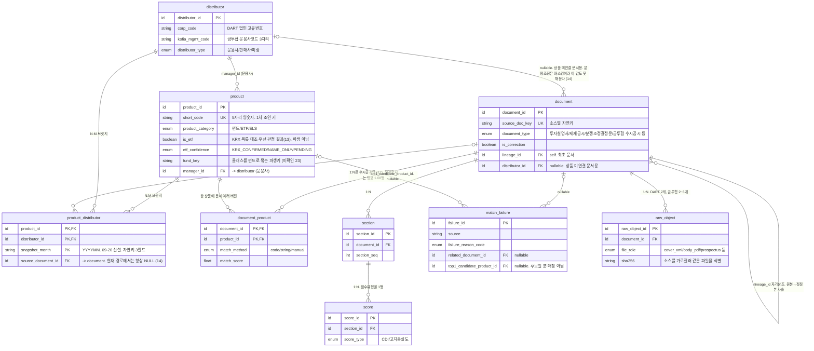

# 01. 논리 스키마 초안 (1단계 데이터 테이블·ERD 설계)

작성일 2026-09-14. 04·05·06 반영 합본(09-14 저녁), web-verify(옆 세션 소스 검증 39건) 반영(09-14 밤, 08 참조). DART 표지 10건 실측(09)·finlife 조사(10) 반영. 00b 검토 메모(09-14 티켓, 팀 실측 + 교차 검증 4건) 반영(09-14 밤). `00_context_brief.md`에 적힌 사실만 사용하고 임의로 추가하지 않는다. 물리 DDL, 인덱스, 파티션, 특정 DB 제품 선택은 다루지 않는다.

## 표 목록 요약

| 표 | 단위 | 이 표가 없으면 안 되는 것 |
|---|---|---|
| 상품 | 상품 1건 | CDI 층화 비교, 문서·점수를 상품 축으로 묶는 기준점이 사라진다 |
| 판매사 | 판매사(또는 운용사) 1건 | 분쟁조정 결정문을 연결할 축이 없어진다 |
| 상품_판매사 | 상품 × 판매사 1쌍 | 한 펀드에 판매회사가 여럿이라 단일 FK로는 담을 수 없다 |
| 문서 | 수집한 원천 문서 1건 (00b 반영) | 원본/정정본 구분과 파싱 실패 플래그를 둘 자리가 없어진다 |
| 문서_상품 | 문서 × 상품 1쌍 (00b 반영, 신설) | 문서 1건이 상품 여러 건을 가리키는 1:N 관계를 단일 FK로 담을 수 없다 |
| 절 | 문서 내 부·절 1건 | 드릴다운(문서 단위가 아니라 절 단위 점수)이 성립하지 않는다 |
| 점수 | 절 1건당 점수 유형별 1행 | CDI와 고지충실도를 구분하지 못해 ELS 행의 CDI가 억지로 비게 된다 |
| 매칭_실패 | 매칭 시도 1건 | 실패가 건수로만 집계돼 어느 표본이 치우쳤는지 못 본다 |
| 원본파일(raw_object) | 원본파일 1건 (00b 반영, 구 수집_이력) | 원본 재현성(언제·무엇을·어떤 응답으로 받았는지)과 사건 1건에 첨부가 여러 개일 때의 파일 단위 추출 상태를 둘 자리가 없어진다 |

9개 표로 잡았다. 화면 순서 테이블(3단계 입출력 Schema 설계 사안)과 정정 이력 SCD 구현(2단계 데이터 파이프라인 Flow 설계 사안)은 별도 표로 만들지 않았다.

---

## 상품

| 칼럼 | 설명 |
|---|---|
| product_id | PK. 내부 발급 서러게이트 키 |
| short_code | 펀드 단축코드 **5자리 영숫자**(E4675, CY091, AT146, EZ258 …). 「영문 1 + 숫자 4」로 고정되지 않으므로 형식 검증은 `[A-Z0-9]{5}`로 한다. DART 투자설명서 표지의 「펀드코드」에 10건 중 10건 존재(09). 공공데이터포털 펀드상품기본정보 `srtnCd`와 같은 체계. 펀드·ETF의 1차 코드 조인 키. **값은 DART 표지 펀드코드 또는 공공데이터포털 `srtnCd`에서 직접 가져온다. 12자리 코드의 substring으로 파생하지 않는다 (00b 반영)**. `kofia_fund_code`가 `K55`+운용사3+단축5+검증1로 분해되는 것은 10에서 확인했지만, 그것은 운용사 조회용 분해이며 short_code의 원천으로 쓰지 않는다. **유일성 단서 (14 반영)**: `srtnCd`는 `asoStdCd[6:11]`과 100% 일치하는 **표준코드의 한 토막**이라 앞 6자리(체계+운용사)가 다르면 겹친다. 전체 165,118종 중 4,899종(3.0%)이 서로 다른 펀드와 코드를 공유한다. **다만 우리 범위에서는 안전하다** — 2015년 이후 설정 펀드끼리 겹치는 것은 5종뿐이고, 「상장지수」 1,435건 안에서는 **겹침이 0**이다. 겹침이 문제가 되면 `(asoStdCd 앞 6자리, srtnCd)` 쌍으로 붙인다(183,648종 중 중복 1종) |
| kofia_fund_code | 금투협 펀드코드 12자리 = `K55` + 운용사 코드 3 + 단축코드 5 + 검증 1 (예: K55105B93082 → 105 삼성자산운용, B9308). 앞 6자리를 「운용사코드」로 부르던 것은 부정확했다 |
| standard_code | 협회표준코드 12자리(KR5…, KRM…). 펀드상품기본정보 `asoStdCd`. kofia_fund_code와 체계가 다르므로 한 칸에 섞지 않는다 |
| isu_cd | 거래소 종목코드. ETF에만 값이 있다. KRX ETF API 또는 공공데이터포털 시세정보의 `ISU_CD` |
| fin_prdt_cd | 금융상품통합비교공시(finlife) 상품코드. **검증 필요**: finlife는 예금·대출·연금 상품 API이므로 펀드·ETF·ELS에 이 코드가 존재하는지 확인되지 않았다 |
| product_name | 상품명 원문 |
| product_name_normalized | 05 1절의 4단계 정규화(상품명)를 거친 매칭용 이름 |
| product_category | 펀드 / ETF / ELS |
| is_etf | ETF 여부. **파생 칼럼이 아니라 KRX 목록 대조 우선 판정 결과다 (13)**. 1차는 KRX `isu_cd` 대조, 2차는 상품명 「상장지수」 포함. 문자열만 쓰면 오탐이 14~30% |
| etf_confidence | ETF 판정 신뢰도 (13 반영, 신설). `KRX_CONFIRMED`(ISU_CD 대조 성공) / `NAME_ONLY`(문자열 규칙만) / `PENDING`(대조 실패, 보류) |
| fund_key | 파생 칼럼 (아키텍트 판정, 09-16 반영, 신설). 05 정규화에서 클래스 표기를 뺀 본체명 + manager_id로 만드는 펀드(종류형 모) 단위 키. 04의 정규화 모집단이 이 키로 클래스 간 중복을 제거한다 |
| risk_grade | 위험등급 1~6 (1이 최고위험). DART 투자설명서 **표지 노드**에 「투자위험등급 2등급[높은 위험]」 형태로 있다(09, 10/10). 공백이 불규칙(「2등급[ 높은 위험 ]」, 「4등급 [ 보통 위험]」)하므로 `(\d)등급` 정규식으로 숫자만 뽑는다. PDF 본문이 아니라 표지에서 추출. 경로는 문서 → 상품 |
| manager_id | FK → 판매사(distributor_type=운용사). DART 제출 법인(corp_code) |
| sale_start_date | 판매시작일. 후보 소스는 펀드상품기본정보 `setpDt`(설정일). 「판매 중」 판정용 (06) |
| sale_end_date | 판매종료일. NULL 허용. NULL이면 판매 중 (06) |
| fund_type | 공공데이터포털 `fndTp` (00b 반영, 신설) |
| product_class_code | 공공데이터포털 `prdClsfCd` (00b 반영, 신설) |
| is_public_offering | 공모 / 사모 (00b 반영, 신설). 필터는 적재 단계에서 적용하고, 원본은 공모·사모 구분 없이 전량 보관한다 (00b A8) |
| valid_from / valid_to | SCD2 예비 칸 (00b 반영, 신설). **2단계 데이터 파이프라인 Flow 설계 사안**: 공공데이터포털이 펀드당 1행만 주어 mart에 이력을 두지 않으면 변경 이력이 영구 소실된다. raw 쪽 버전 누적(02)이 있어 재구성 자체는 가능하지만 조회할 때마다 raw를 다시 읽어야 해 비용이 크다 |

**결정**: 위험등급은 상품 표의 칼럼으로 두되, DART `corp_code` 조인이 아니라 투자설명서 본문에서 추출해 문서 → 상품 경로로 채운다. `corp_code`는 상품 표에서 빼고 판매사 표로 옮긴다.
**근거**: DART의 `corp_code`는 공시를 제출한 법인(펀드라면 운용사)의 고유번호이므로 상품 단위 값이 아니다. 위험등급은 상품마다 다르므로 법인 코드로는 붙일 수 없고, 상품별 투자설명서(`rcept_no`)에서 나와야 한다. 「위험등급은 DART 한 소스에만 있다」는 09-09 확정 사항과도 일치한다. **단 그 확정은 09-20에 흔들렸다** — `16` 3절 실측에서 **금투협 수시공시 첨부 PDF 본문에도** `투자 위험등급 N등급[명칭]` 표기가 확인됐다. DART 표지가 유일한 원천은 아니다. 이 문장을 근거로 삼는 `04` 3-2절(위험등급 결측의 내생성 논증)을 다시 봐야 한다 → **미확인 22**.
**확인됨(web-verify A1·F3)**: 위험등급은 표지 요소(eleId=2)에 「투자위험등급 2등급[높은 위험]」 형태로 있다. 표기가 「n등급[문구]」이므로 숫자만 뽑는 파생 규칙이 필요하다. 산정 주체는 원칙상 판매업자이지만 투자설명서 표지 값은 집합투자업자(운용사) 분류다. 소스가 이것 하나뿐이므로 「산정 주체」 칸은 두지 않고, 판매사 산정 등급 소스가 추가되면 그때 칸을 추가한다.
**확정(아키텍트, 09-16 반영)**: 산정 주체 필드와 정량 9·정성 6 요소 칸은 두지 않는다. 우리 소스 어디에도 요소별 값이 없다. 판매사별로 등급이 갈리는 소스가 추가되면 그때 등급을 상품 칸이 아니라 (상품 × 산정 주체) 행으로 바꾼다.

**결정**: 펀드·ETF의 1차 조인 키는 `fin_prdt_cd`가 아니라 `short_code`(단축코드 5자리)다.
**근거**: DART 투자설명서 표지에 「펀드코드 : E4675」 형태로 단축코드가 들어 있고(web-verify A4), 공공데이터포털 펀드상품기본정보의 `srtnCd`가 같은 체계다(C1). 둘이 맞으면 DART 문서 ↔ 상품 연결이 문자열 매칭이 아니라 코드 매칭이 된다. 05의 문자열 매칭은 단축코드가 없거나 어긋나는 건에만 쓰는 2차 수단으로 내려간다.
**확인됨(09, 10)**: 표지 펀드코드는 10건 중 10건에 있었다(운용사 4곳, ETF 3건, 정정본 6건 포함). finlife 오픈 API 8종에는 펀드·ETF·ELS가 없으므로 `fin_prdt_cd`는 펀드 조인 키가 아니다.
**미확인**: ELS 식별 키. 후보는 발행사 회차 번호(「제29976회」), KR6…형 표준코드, DART 「일괄신고추가서류」 단위(10). 09-16 결정 사항.

**결정 (00b 반영)**: 상품 매칭은 단일 키가 아니라 3단 계단식으로 시도한다. 1차 코드(short_code / standard_code) → 2차 정규화 펀드명(05) → 3차 운용사명 + 설정일(setpDt). 어느 단에서 붙었는지는 문서_상품.match_method에 남긴다.
**근거**: 단축코드 단일 키에만 의존하면 코드가 없거나 어긋나는 건에서 매칭 실패가 특정 판매사·ETF에 몰려 결측이 MNAR(무작위가 아닌 결측)이 되고, 이는 통계적으로 교정할 수 없다(00b A2).

**결정**: 「판매 중」은 상태 칸이 아니라 `sale_start_date`·`sale_end_date`와 채점기준일(점수 표 `baseline_date`)로 판정한다.
**근거**: 06이 스냅숏 기준일 방식을 채택했고, 판정 로직은 「기준일이 시작일 이후이고, 종료일이 NULL이거나 기준일보다 뒤」이다. 상태 칸을 따로 두면 날짜와 어긋날 수 있어 두지 않는다.
**미확인**: 판매시작일·종료일이 어느 소스의 어느 필드에 있는지. 금융상품통합비교공시에 있을 가능성이 높으나 현황표(09-14)에서 확인한다.

**결정 (13으로 교체)**: is_etf는 파생 계산 칼럼이 아니라 **KRX 목록 대조 우선 판정 결과**다. 1차로 KRX `isu_cd` 대조가 붙으면 확정하고, 붙지 않은 건에만 「상장지수」 문자열 규칙을 쓴다. 어느 단에서 정해졌는지는 `etf_confidence`에 남긴다.
**근거(13)**: 문자열 규칙은 재현율이 완벽하지만(누락 0/938 = 0.00%) 정밀도가 낮다(오탐 435/1,435 = 최대 30.3%, 최소 14.4%). 상품군 분류가 틀리면 CDI 측정 대상 집합이 통째로 틀어지고 04의 비교 모집단이 왜곡된다. 09-09에 확정했던 「상품명에 「상장지수」 포함」 규칙은 **후보 선별용으로 강등**한다.
**미확인(13)**: KRX ETF 1,167건 중 229건은 이름 표기 차이로 공공데이터포털 레코드에 붙지 않았다. 이 잔여의 처리 방침은 09-20 안건이다.
**미확인**: product_name이 어느 소스의 원천 필드를 그대로 쓰는지는 현황표(09-14)에서 확인한다.

**확정(아키텍트, 09-16 반영)**: 상품 표 한 행의 단위는 **클래스**(단축코드 5자리 하나 = 한 행)다.
**근거**: short_code와 srtnCd가 모두 클래스 입자라, 상품 행을 펀드 단위로 잡으면 1차 조인 키(short_code)가 유일하지 않게 되고 클래스별 판매시작일·판매종료일을 둘 자리도 사라진다. 대신 `fund_key` 파생 칼럼을 상품 표에 추가해 클래스를 펀드(종류형 모) 단위로 묶는다.

---

## 판매사

| 칼럼 | 설명 |
|---|---|
| distributor_id | PK |
| corp_code | DART 법인 고유번호(공시 제출 법인). 상품 표에서 이관. 코드 매칭 |
| kofia_mgmt_code | 금투협 운용사 코드 **3자리 영숫자**(105 = 삼성자산운용, 210 = 신한자산운용, 301 = 미래에셋자산운용). 12자리 펀드코드는 `K55` + 운용사 3 + 단축코드 5 + 검증 1 이다. 대응표 536건은 `reference/kofia_mgmt_codes.csv`(금투협 공지 첨부에서 추출, 09-14) |
| distributor_name | 원문명 |
| distributor_name_normalized | 05 **9절**(법인명)의 5단계를 거친 정규화명. 매칭용. 상품명용 1절 규칙을 쓰지 않는다 — 법인명에는 클래스 표기가 없고 대신 상호 변경이 있다 |
| distributor_type | 운용사 / 판매사 / 미상 |

**결정**: 운용사와 판매사를 표 하나에 두고 distributor_type으로 구분한다. 상품과의 연결은 아래 상품_판매사 표로 N:M이다.
**근거**: 한 펀드는 운용사 하나에 판매회사 여럿이다. 법인 실체는 같은 종류이므로 표를 나눌 이유는 없지만, 상품과의 관계는 단일 FK로 담을 수 없다. (web-verify A1은 표지에 판매회사가 적힌다고 했으나 10건 실측(09)에서는 명단 없이 「각 판매회사 본·지점」 안내 문구만 있었다. 명단 소스는 아래 상품_판매사 참조.)
**확인됨(09-14)**: 금투협 운용사 코드는 3자리이며 대응표 536건을 `reference/kofia_mgmt_codes.csv`로 확보했다. 판매사 표의 운용사 행은 이 표로 시드할 수 있다.
**미확인**: 운용사 코드 ↔ DART corp_code 대응. 운용사명 문자열로 1회 매칭해 고정하면 된다(536건, 수동 검수 가능 규모).

---

## 상품_판매사

| 칼럼 | 설명 |
|---|---|
| product_id | FK → 상품 |
| distributor_id | FK → 판매사 |
| source_document_id | FK → 문서. 이 연결을 알려 준 문서(판매회사 명단이 있는 곳). 소스가 정해지면 NULL 허용 여부를 정한다 |
| **snapshot_month** | **`YYYYMM`. 이 판매 관계를 관측한 월 (09-20 신설)**. 아래 「규모」가 「월 스냅숏이므로 기준일을 함께 적재한다」고 이미 정했는데 담을 칸이 없었다. **자연키는 `(product_id, distributor_id, snapshot_month)`다** — 이 칸 없이 `(product_id, distributor_id)`로 upsert하면 매달 과거 판매 관계를 경고 없이 덮어쓴다 |

**결정**: 상품과 판매사를 N:M으로 잇는 표를 둔다. 상품 표의 단일 `distributor_id`는 없애고 운용사만 `manager_id`로 남긴다.
**근거**: 분쟁조정 결정문을 판매사 축으로 붙이거나 매칭 실패의 판매사 편향을 볼 때 이 연결이 필요하다.
**확인됨(14)**: 판매회사 명단의 소스는 **금투협 전자공시**다. 「판매사별 펀드보수비용」 서비스가 판매사코드로 조회하면 그 판매사가 파는 펀드를 표준코드로 돌려준다. DART 표지에는 명단이 없고(09) PDF 본문 추출도 필요 없다. **`source_document_id`는 이 경로에서는 NULL이다** — 명단이 문서가 아니라 별도 조회에서 오기 때문이다.
**규모**: 판매사 200곳 × 평균 3,000건 ≈ 60만 행. 월 스냅숏이므로 기준일을 함께 적재한다.
**한계(14)**: 「상장지수」가 0건이라 **ETF는 이 소스로 판매사를 붙일 수 없다.**

---

## 문서 (수집한 원천 문서 1건 단위) (00b 반영)

**결정 (00b 반영)**: 문서 표 한 행의 단위를 「수집한 원천 문서 1건」으로 정한다. DART는 접수번호 단위, 금투협 수시공시는 공고 1건 단위(클래스 단위가 아님), 제재공시는 제재정보번호 단위, 분쟁조정은 게시글 번호 단위다.
**근거**: (1) 금투협 15행이 가리키는 실제 PDF는 하나다. 클래스 단위로 두면 같은 PDF에 15개 행이 붙어 본문 추출을 15번 수행하게 된다. (2) 문서 한 줄이 원본 파일 하나와 1:1로 대응해야 원본 경로·콘텐츠 해시·추출 상태·재처리 단위가 같은 입자에서 관리된다. (3) DART가 같은 사건을 이미 문서 1건으로 제공하므로, 두 소스의 입자를 통일하려면 더 굵은 쪽(공고 1건)에 맞춘다(00b A1).

| 칼럼 | 설명 |
|---|---|
| document_id | PK. 내부 발급 |
| source_doc_key | 소스 공통 자연키 (00b 반영, `rcept_no`에서 일반화). 소스별 값 규칙은 아래 표를 따른다 |
| rcept_no | DART 접수번호. **DART 전용 칸** (00b 반영). DART가 아닌 소스는 NULL |
| dcm_no | DART 문서번호. 본문 PDF를 `download.do?dcmNo=`로 받을 때 필요. **DART 전용 칸** (00b 반영) |
| corp_code | DART 법인코드(제출 법인 = 운용사) |
| document_type | 투자설명서 / 간이투자설명서 / 일괄신고서 / 효력발생안내 / 제재공시 / 분쟁조정결정문 / **금투협 수시공시 (00b 반영, 신설)** / **경영유의공시 (14 6절, 후보 — 채택 미정)** |
| report_name | DART 보고서명 원문(「[기재정정] 투자설명서」 등). document_type은 여기서 파생 |
| pblntf_detail_ty | DART 세부유형 코드 G001/G002/G003. 수집 필터는 이 코드로, 문서 종류 판별은 report_name으로 |
| body_format | 본문 파일 형식: pdf / hwp5 / hwp3 / hwp_dist / xml_only. 03의 파싱 판정에 쓴다 |
| distributor_id | FK → 판매사. 상품 연결이 없는 문서(분쟁조정결정문 등)를 판매사 축에 붙이기 위한 칼럼 |
| is_correction | 정정본 여부. **판정 근거를 「report_name의 [기재정정] 접두어」에서 「정정신고 노드의 최초제출일 존재 여부」로 바꾼다 (00b 반영)**. report_name 접두어는 [발행조건확정] 등 변형이 있어 문자열 매칭만으로는 정정본을 놓치는 경우가 생긴다(00b) |
| lineage_id | FK(self) (00b 반영, `original_document_id`에서 교체). 같은 사건의 최초 문서 id. 최초 문서는 자기 자신을 가리킨다 |
| version_no | 파생 칼럼 (00b 반영, 신설). lineage 안에서 received_date 순번 |
| is_current | 파생 칼럼 (00b 반영, 신설). 물리화 여부는 2단계 데이터 파이프라인 Flow 설계에서 결정 |
| initial_submit_date | 정정본이면 정정신고 요소에 적힌 최초제출일. 원본이면 received_date와 같다 |
| received_date | 접수일자 |
| parse_status | 문서 단위 파싱 성공/실패 플래그. **정의를 「하위 원본파일 extract_status의 집계값」으로 바꾼다 (00b 반영)**. 판정 기준은 03. 값 집합 `PARSE_OK` / `PARSE_PARTIAL` / `PARSE_FAILED` **(09-20 확정)** |

### source_doc_key 소스별 값 규칙 (00b 반영, 신설)

| 소스 | source_doc_key 값 | 비고 |
|---|---|---|
| DART | rcept_no | 접수번호 그대로 |
| 금투협 수시공시 | `(companyCd, standardDt, announceTtl, tmpV1)` 해시 (00b A8) | **확인됨(12)**: tmpV1을 빼면 삼성 2026-08-13 「투자설명서 변경」 한 묶음에 서로 다른 펀드 72종 234행이 한 묶음으로 합쳐진다. 4항목 그대로 확정 |
| 제재공시 | 제재정보번호(`emOpenNo`) | 경영유의공시를 함께 받으면 **`(소스, emOpenNo)`**로 둔다. 두 API가 같은 번호 공간을 쓰는지 미실측 (14 6절) |
| 분쟁조정 | 게시글 번호 | — |

**금투협 행 읽을 때 주의 2건 (12 반영)**
- `tmpV1`이 `ZZZZZZ…`로 시작하는 행은 **모펀드 행 표시자이지 결측이 아니다**(표본 33건). 결측으로 보고 제거하거나 치환하면 자연키가 깨져 서로 다른 공고가 한 묶음으로 합쳐진다.
- 클래스 행은 `uFundNm`이 **`└▶`로 시작**한다. 표본 1,499행이 클래스 1,087 / 모·단독 412로 완전히 갈린다. 모·자 구분에 유사도 추측이 필요 없다.

**결정**: DART 투자설명서 한 건은 원본 파일이 둘이다. `document.xml` API가 주는 XML(표지·정정요약·PDF 링크)과 `download.do`로 받는 본문 PDF. 위험등급·펀드코드·집합투자기구 명칭·작성기준일은 XML 표지에서, 절 본문은 PDF에서 뽑는다. 판매회사 명단은 표지에 없다(09).
**근거**: web-verify A1과 09 실측 10/10. [본문] 요소는 10건 모두 PDF 다운로드 링크 정확히 1개였다. **간이투자설명서는 DART에서 별도 첨부가 아니다 (09-20 정정, `17`).** 초판은 web-verify A2에 기대어 「같은 접수번호의 첨부 노드에 있다」고 적었으나, 본문 PDF를 실제로 열어 보니 **목차 뒤에 「요약 정보 = 간이투자설명서」가 같은 PDF 안의 절로** 들어 있다. 별도 `raw_object`가 생기지 않으므로 **수집 모듈이 이를 첨부로 찾으면 못 찾는다.** 소스 간 중복률 측정 설계도 이 때문에 바뀐다(`gate-b`). 보관 규칙은 02에 있다.
**결정**: 표지 노드는 eleId로 고정하지 않고 노드 텍스트 「투 자 설 명 서」로 찾는다. `dcmNo`·`eleId`·`offset`·`length`는 `dsaf001/main.do?rcpNo=` HTML 안의 `treeData` 스크립트에서 정규식으로 뽑는다.
**근거**: 원본은 표지가 eleId=1, [기재정정]은 정정신고 노드가 앞에 붙어 표지가 eleId=2다(09). 고정 번호로 읽으면 원본과 정정본 중 하나는 반드시 틀린다.
**확인됨(09)**: 정정신고 노드에 「2. 정정대상 공시서류의 최초제출일 : 2023년 07월 31일」 문구가 그대로 있다. `initial_submit_date`는 이 문구에서 파생하고, `lineage_id`(00b 반영, 구 `original_document_id`)는 같은 short_code + received_date = 최초제출일인 문서로 잇는다. 최초제출일이 수년 전일 수 있어 사슬이 길다.

**결정 (00b 반영)**: 분쟁조정 결정문은 문서_상품 브릿지 행을 만들지 않고 distributor_id로만 연결한다.
**결정 (14 반영, 09-20 명시)**: **제재공시와 경영유의공시도 같다.** 문서_상품 브릿지 행을 만들지 않는다. 응답 13개 필드에 상품을 가리키는 칸이 없고 본문도 `㉮펀드`로 마스킹이다. **매칭 모듈은 이 두 `document_type`을 문서_상품 매칭 대상에서 아예 제외해야 한다** — 시도했다가 실패 로그를 쌓는 것은 헛수고이고, 실패율 통계도 왜곡된다(`05` `NO_CODE_IN_SOURCE`).
**근거**: 분쟁조정 결정문(814건 중 금융투자 187건)은 상품명이 전부 마스킹되어 상품 단위로 이어 붙일 값이 없다고 09-09에서 확정되었다. Epic 5층 원칙에도 「분쟁조정 결정문은 상품 표에 연결하지 않는다」가 명시되어 있다.
**미확인**: 분쟁조정 결정문 텍스트에 판매사명이 실제로 식별 가능한 형태로 남아 있는지는 현황표(09-14)에서 확인해야 한다. 확인되지 않으면 distributor_id도 NULL로 두고 문서 표에만 존재하는 미연결 레코드가 된다.

**결정 (00b 반영)**: is_correction, lineage_id, version_no, is_current 네 칼럼만 미리 두고, 정정본 판정 규칙과 SCD 구현은 지금 하지 않는다.
**근거**: Epic 실패 처리 정책 ③(원본 vs 정정본 중 무엇으로 CDI 계산)은 이력 관리 구현보다 먼저 정해야 하는 규칙이라 06(data-scientist 담당)에서 다룬다. 09-16은 「나중에 이력화할 수 있도록 칸만 확보」하는 범위다.

**확정(06)**: CDI는 최신 정정본으로 계산하고, 정정본이 없으면 원본으로 계산한다. 원본과 모든 정정본은 전부 보존한다(02 버전 누적 규칙과 연결).
**결정**: 정정본은 별도 문서 행(`source_doc_key`가 다름)이므로 문서 버전 식별자는 `document_id` 자체다. 점수 표에 버전 칸을 따로 두지 않고 절 → 문서 경로로 추적한다. 「최신본」은 `lineage_id`(00b 반영, 구 `original_document_id`) 사슬과 `version_no`·`is_current`로 파생하며, `is_current`를 물리 칼럼으로 둘지는 2단계 데이터 파이프라인 Flow 설계 이력 설계에서 정한다.
**근거**: 절 단위 점수는 이미 특정 문서 행에 매여 있어 계산에 쓰인 버전이 자동으로 기록된다. 칸을 더 두면 같은 사실을 두 곳에 적게 된다.

---

## 문서_상품 (문서 × 상품 1:N 브릿지) (00b 반영, 신설)

| 칼럼 | 설명 |
|---|---|
| document_id | FK → 문서 |
| product_id | FK → 상품 |
| match_method | code / string / manual. 01 상품 표의 3단 계단식(1차 코드 → 2차 정규화 펀드명 → 3차 운용사명+설정일) 중 어느 단에서 붙었는지 |
| match_score | 매칭 점수(문자열 매칭이면 유사도, 코드 매칭이면 1.0) |
| matched_at | 매칭 시각 |

**결정**: 문서.product_id 단일 FK를 없애고, 문서와 상품을 이 브릿지 표로 1:N(문서 1건이 상품 여러 건을 가리킴)로 연결한다.
**근거**: 금투협 클래스 행 N개가 같은 공고 PDF 1개를 가리키는 구조에서, 문서 1건이 공고 단위로 접히면 그 문서는 클래스별 상품 여러 건에 동시에 연결되어야 한다(00b A1). 단일 FK로는 이 관계를 담을 수 없다.

**확정(아키텍트, 09-16 반영)**: 상품 행의 단위는 클래스다(위 상품 절 참조). 문서_상품 브릿지의 product_id는 클래스 단위 행을 가리킨다.

**확인됨(12)**: 문서 1건이 상품 N건을 가리키는 1:N은 **수시공시(`uRptGb='O'`, tsCd `2OF…`)에서만** 발생한다. 표본에서 수시는 자연키 묶음 평균 3.02행, 정기(`2RF…`)는 1.08행으로 사실상 1:1이다. 정기공시는 클래스·펀드마다 별도 보고서가 나오므로 브릿지가 생겨도 행이 하나다.

### 금투협 수시공시를 문서 소스로 추가 (00b 반영, 신설)

**결정**: 금투협 클래스 행 N개 중 같은 `announceTtl`·`standardDt` 묶음을 문서 1건으로 접는다. PDF sha256으로 보조 확인한다.
**근거**: 금투협 수시공시는 클래스 행 단위로 15행이 조회되지만 실제 PDF는 1개다. 문서 단위를 「수집한 원천 문서 1건」으로 정한 규칙(위 문서 절)과 일치시키려면 클래스 행이 아니라 공고 단위로 접어야 한다(00b B1). 09-15 실측(00b A7, 금투협 15행 동일 PDF 여부)에 따라 이 규칙이 바뀔 수 있음을 표시한다. 조인 키는 「소스별 조인 키 대조표」에 행으로 추가했다.

---

## 절 (문서 내 부·절 단위)

| 칼럼 | 설명 |
|---|---|
| section_id | PK |
| document_id | FK → 문서 |
| section_seq | 문서 내 부·절 순번 |
| section_title | 절 제목 |
| section_text | 정규화된 본문 텍스트 |
| extract_status | 본문 추출 성공/실패 플래그. 판정 기준은 03. 성공 = `EXTRACT_OK`, 일반 실패 = `EXTRACT_FAILED`, 세분 사유 4종은 유지 **(09-20 확정)** |

**결정**: 점수를 절 단위로 저장하기 위한 전제 표로 절을 문서와 분리한다.
**근거**: 진단 도구형(B)이 드릴다운 화면으로 흡수되려면 점수가 문서 단위가 아니라 절 단위로 있어야 한다고 최종 산출물 성격에 명시되어 있다.

---

## 점수 (절 단위)

| 칼럼 | 설명 |
|---|---|
| score_id | PK |
| section_id | FK → 절. 절 → 문서 경로로 계산에 쓰인 문서 버전이 정해진다 |
| score_type | CDI / 고지충실도. CDI 행은 펀드·ETF에만 존재하고 ELS에는 행 자체가 없다 |
| raw_score | 원점수 |
| normalized_score | 비교 모집단 안에서의 정규화 값(백분위 등). 모집단 미달 층이면 NULL (04 4절) |
| comparison_population_key | 채점 시점의 모집단 키 스냅숏. 정의는 상품군 × 위험등급 (04) |
| baseline_date | 채점기준일. 「판매 중」 판정과 전수 범위를 정하는 스냅숏 날짜 (06) |
| section_weight | 문서 점수 집계용 가중치 후보. 비워 둔다. 3단계 입출력 Schema 설계 사안 |
| score_payload | 3단계 입출력 Schema 설계에서 잠글 「CDI 출력」 데이터 계약이 들어갈 자리. 모양은 지금 정하지 않는다 |
| scored_at | 채점 시각 |

**결정**: score_type 칼럼으로 CDI와 고지충실도를 한 표 안에서 구분하고, 표를 둘로 쪼개지 않는다.
**근거**: CDI는 펀드·ETF만, 고지충실도는 ELS를 포함해 계산 대상이 다르다(09-09 확정). 표를 분리하면 ELS 행에 CDI 칼럼이 항상 비는 문제가 그대로 표로 옮겨질 뿐이므로, score_type으로 나누는 쪽이 더 단순하다.
**3단계 입출력 Schema 설계 사안**: score_payload의 구체적인 JSON 모양은 3단계 입출력 Schema 설계(10-14)에서 「LLM 추출 결과 JSON」·「CDI 출력」 계약 2종이 잠긴 뒤 확정한다.
**결정**: 문서 단위 점수 표는 만들지 않는다. 문서 점수는 절 점수의 집계 뷰로 파생한다.
**근거**: 04가 진실 소스를 절 하나로 통일했다. 집계 공식은 3단계 입출력 Schema 설계 사안이며, 잔차 회귀의 입력은 절 표가 아니라 이 뷰다.
**확정(04)**: comparison_population_key는 상품군 × 위험등급이다. 판매사·문서 유형·제출연도는 층화 축에 넣지 않는다. 층당 최소 30건(잠정값) 미달이면 normalized_score를 비운다.

---

## 매칭_실패 (행 단위)

| 칼럼 | 설명 |
|---|---|
| failure_id | PK |
| source | 실패가 발생한 소스 |
| attempted_key_value | 매칭을 시도한 키값. 코드 매칭 실패 시 코드, 문자열 매칭 실패 시 원문 상품명 |
| normalized_value | 05 1절의 4단계 정규화(상품명)를 거친 문자열. 코드 매칭이면 NULL |
| top1_candidate_product_id | 유사도가 가장 높았던 상품. 없으면 NULL |
| top1_similarity | 그 후보의 유사도 점수 |
| failure_reason_code | PENDING_MASTER / AMBIGUOUS / NO_CANDIDATE / NO_CODE_IN_SOURCE / BELOW_THRESHOLD / NORMALIZE_FAILED (00b 반영, 아래 상태값 표 참조) |
| attempted_at | 시도 시각 |
| status | 미해결 / 수동확인중 / 보류 |
| related_document_id | FK → 문서. 있으면 연결 |

**결정**: 매칭 실패를 건수 집계가 아니라 행 단위로 남긴다.
**근거**: 문자열 조인 실패가 ETF·특정 판매사에 몰려 표본을 한쪽으로 치우치게 하고, 조인에서 밀린 상품은 위험등급이 비어 잔차 회귀에서 통째로 버려지기 때문이라고 스키마 반영 5항목에 명시되어 있다.
**확정(05, 잠정값)**: 상품명 유사도 0.85 이상 자동 매칭, 0.60~0.85 수동 확인 대상, 0.60 미만 실패. 숫자 토큰은 완전 일치를 강제한다. 판매사명은 별도 임계치 0.95. 잠정값은 라벨 200건으로 확정한다. 정규화(상품명 1절 4단계, 법인명 9절 5단계)와 유사도 방법은 05를 따른다.

**failure_reason_code 상태값 (00b 반영, A5)**

| 상태값 | 의미 | 재처리 |
|---|---|---|
| PENDING_MASTER | 마스터 미도착. DART가 금투협·공공데이터포털보다 6~18일 선행하는 것은 오류가 아니라 정상 대기 상태다 | 30일 재시도 |
| AMBIGUOUS | 다중 후보 | 수동 큐 |
| NO_CANDIDATE | 후보 없음 | 주 1회 재시도 |
| NO_CODE_IN_SOURCE | 분쟁·제재처럼 소스 자체에 코드가 없는 구조적 특성 | 재시도 대상 아님 |
| BELOW_THRESHOLD | 임계치 미달 | — |
| NORMALIZE_FAILED | 정규화 실패 | — |

05의 A(임계치 미달)~D(정규화 실패) 분류와의 대응: A→BELOW_THRESHOLD, B→NO_CANDIDATE, C→AMBIGUOUS, D→NORMALIZE_FAILED. PENDING_MASTER·NO_CODE_IN_SOURCE는 05에 없던 상태로 이번에 추가됐다.

---

## 원본파일 (raw_object, 00b 반영, 구 수집_이력)

**결정 (00b 반영)**: 수집_이력을 「수집 요청 1건」 단위 표에서 「원본파일 1건」 단위 표로 고친다.
**근거**: 사건(문서) 1건에 첨부가 여러 개 붙는다. 수집·추출의 성공·실패는 문서 단위가 아니라 파일 단위로 판정해야 한다. 112(추출 성공)·94(HWP 3.0)·7(배포용)도 전부 파일 단위 실측이며 사건 187건 단위가 아니다(00b A2, B3).

| 칼럼 | 설명 |
|---|---|
| raw_object_id | PK |
| document_id | FK → 문서 |
| file_role | `cover_xml` / `body_pdf` / `api_response` / `attachment` 및 **금투협 첨부 3종 (12 반영, 신설)**: `prospectus`(투자설명서) / `prospectus_simple`(간이투자설명서) / `change_summary`(변경대비표·규약). **CDI 채점 대상을 가리는 유일한 칸이다** — 금투협은 문서 1건(공고)에 첨부가 2~3종이고 `document_type`은 「금투협 수시공시」 한 값이므로, 이 칸이 없으면 어느 파일을 채점할지 정할 자리가 없다 |
| sha256 | 파일 콘텐츠 해시. 02의 재수집 시 버전 증가 여부·중복 저장 판정 키 (09-16 아키텍트 반영). **소스를 가로질러 같은 파일을 식별하는 유일한 수단이기도 하다 (12 반영)** — `source_doc_key`는 소스별로 체계가 달라 소스 간 중복(간이투자설명서가 금투협·DART 양쪽에서 옴)을 자연키로는 잡을 수 없다 |
| storage_path | 저장 경로. 02_raw_storage_policy.md의 `raw/{source}/{collected_date}/{source_doc_key}__v{n}.{ext}` 규칙을 따름 |
| blob_path | **2단계 데이터 파이프라인 Flow 설계 후보 칸 (09-16 아키텍트 반영)**. CAS(`blobs/{sha256 앞 2자}/{sha256}`) 채택이 2단계 데이터 파이프라인 Flow 설계로 미뤄져 현재는 쓰지 않는다. 02 참조 |
| file_name | 원본 파일명 |
| content_type | MIME 타입 |
| collected_at | 수집 시각(요청을 보낸 시각) |
| request_params | 요청에 사용한 파라미터 전체 |
| response_code | 응답 코드(HTTP 상태 등) |
| collect_status | success / failed / permanent_failed 등. 03의 수집 실패 판정과 연동 |
| extract_status | 본문 추출 성공/실패 플래그. 03의 본문 추출 판정과 연동. 절 표와 같은 값 집합, 성공 = `EXTRACT_OK` **(09-20 확정)** |

**결정**: 수집 단계의 실패도 격리 폴더로 파일을 옮기지 않고 이 표의 collect_status 칼럼으로만 표시한다.
**근거**: 02의 원본 불변 원칙과 맞물려 파일 이동 자체를 만들지 않는 편이 더 단순하다. 자세한 판정 기준과 재시도 정책은 03을 따른다.
**결정 (00b 반영)**: 문서.parse_status는 하위 원본파일 extract_status의 집계값으로 정의한다. 절 표의 extract_status는 기존대로 절 단위 판정을 그대로 유지한다.
**근거**: 성공·실패 판정의 최소 단위가 파일이므로, 문서 단위 플래그는 그 파일들의 집계여야 이중 판정을 피할 수 있다.

---

## 소스별 조인 키 대조표

「Join 확인」 티켓(주영)의 인계 표다. **판정** 열은 코드 / 문자열 / 값적재 / 없음 넷 중 하나이고, **확인** 열이 `확인됨`이 아닌 행은 아직 대현의 추정이다. 주영은 확인 열이 `대기`인 행만 채우면 된다. 채우는 방법은 `07_handoff_joowon.md` 「결과 기재 양식」에 있다.

| # | 소스 | 필드 | 어느 표의 어느 칸에 붙는지 | 판정 | 확인 | 근거 / 남은 일 |
|---|---|---|---|---|---|---|
| J1 | OPEN DART 표지 노드 | 펀드코드 5자리 | 상품.short_code | **코드** | 확인됨(09) | 펀드·ETF 1차 키. 10건 중 10건 존재, ETF 3건 포함 |
| J2 | 공공데이터포털 펀드상품기본정보 | srtnCd | 상품.short_code | **코드** | 확인됨(14) | DART 표지 펀드코드 10건 중 **7건이 `srtnCd`에 그대로 있었다**. 형식은 전건 `[A-Z0-9]{5}`(165,118종 전부). **단서**: `srtnCd`는 전역 유일이 아니다(4,899종 겹침, 3.0%) → 아래 유일성 단서 참조 |
| J3 | 공공데이터포털 펀드상품기본정보 | asoStdCd, fndNm, setpDt, fndTp | 상품.standard_code, product_name, sale_start_date, product_category 후보 | 값적재 | 확인됨(10) | 조인 키가 아니라 값 적재. 운용사·위험등급·기준가는 없다 |
| J4 | OPEN DART | rcept_no, dcmNo | 문서.rcept_no(=source_doc_key), 문서.dcm_no | **코드** | 확인됨(09) | 접수번호는 자연키 그대로 |
| J5 | OPEN DART | corp_code | 판매사.corp_code (제출 법인 = 운용사) | **코드** | 확인됨(09) | corp_code ↔ kofia_mgmt_code 대응은 별건(미확인, 판매사 절) |
| J6 | OPEN DART 표지 노드 | 투자위험등급, 집합투자기구 명칭, 작성기준일 | 상품.risk_grade, product_name, 문서 메타 | 값적재 | 확인됨(09) | 등급은 `(\d)등급` 정규식. 판매회사 명단은 표지에 **없음** |
| J7 | 금투협 수시공시 | tmpV1(12자리), standardCd | 상품.kofia_fund_code **와** 상품.standard_code (값별 분기) | **코드** | 확인됨(12) | **한 칸에 두 체계가 섞인다.** 표본 1,499행에서 `standardCd`는 K55 887 / KR5 603 / KRM 9. 적재 시 접두 3자로 분기해 `K55…`는 kofia_fund_code, `KR5…`·`KRM…`은 standard_code로 보낸다. `tmpV1`의 의미는 공시 유형에 따라 다름(12 5절) |
| J8 | 금투협 전자공시 「판매사별 펀드보수비용」 | `tmpV17`(표준코드) + 판매사코드 | 상품_판매사 | **코드** | 확인됨(14) | 소스 확정. `DISSalesCompFeeCmsSO.select`가 판매사별 펀드 목록을 주고, `DISMngCompInqSO.select`가 판매회사 마스터 200건을 준다. **법인명 문자열 매칭이 필요 없다.** 단 「상장지수」는 0건이라 **ETF는 이 소스로 판매사를 붙일 수 없다** |
| J9 | 금융상품통합비교공시(finlife) | fin_prdt_cd | (없음) | **없음** | 확인됨(10) | 오픈 API 8종에 펀드·ETF·ELS 없음. 조인 키로 성립하지 않는다. 소스 존치 여부는 09-16 안건 |
| J10 | KRX ETF API / 공공데이터포털 시세 | ISU_CD | 상품.isu_cd | **문자열** | 확인됨(13) | `isu_cd`는 상품 표의 칸이지만 그 칸을 **채우는 수단은 코드가 아니라 이름**이다. 둘을 잇는 코드 소스가 없어 ETF 종목명으로 붙여야 하고, 실측 매칭률은 완전일치 0.0% / 포함매칭 80.4%다(13 4절). 잔여 229건은 판정 불가 → 미확인 2 |
| J11 | 금감원 검사결과제재 OPEN API | 제재정보번호 | 문서(제재공시).source_doc_key | **코드** | 확인됨(web-verify 수집 스케줄 실행 방식) | 전용 OPEN API 존재. 게시판 크롤링 불필요 |
| J12 | 금감원 검사결과제재 OPEN API | `finInstName`(금융회사) | 문서.distributor_id | **문자열** | 확인됨(14) | 금감원 공개 샘플로 판정. **표기는 법인격 없는 약칭(`교통은행`)이라 05 9절 1~4단계가 사실상 무동작**이고 5단계만 남는다. 응답 13개 필드에 **상품을 가리키는 칸이 없고, 본문 `actObjContent`도 `㉮펀드`로 마스킹**이다 → **문서_상품 브릿지 행을 만들지 않는다**(문서 표의 단일 `product_id` FK는 이미 없앴다). 제재는 **판매사 단위 신호**다. 교차 확인 수단은 `actReqDate` 하나뿐 |
| J13 | 국가법령정보 | MST, JO | 미정 | 미판정 | 대기(주영) | 절 본문 내 법령 인용(금소법 제19조 등) 참조로 추정. **조인이 아니라 텍스트 참조일 가능성이 높다** — 그렇다면 대조표에서 빼고 절 표의 파생 항목으로 옮긴다 → 미확인 3 |
| J14 | 금감원 분쟁조정결정례 | **없음** | 연결 불가 | **없음** | 확인됨(14) | 상품명뿐 아니라 **판매사명도 마스킹**이다(8건 전부 `●●증권`·`○○○○○○ 주식회사` 형태). `distributor_id`도 채울 수 없어 **문서 표에만 존재하는 미연결 레코드**가 된다. 단 업종(증권·은행·보험·카드)은 남는다 |

**집계**: 14행 중 **확인됨 13행**(J2·J7·J8·J10·J14가 09-19 실측으로, **J12가 09-20 스펙 샘플로** 해소), **대기 1행(J13)**. J13은 판정 이전에 「조인인가 텍스트 참조인가」를 먼저 정해야 하며, 그것도 인증키가 아니라 **금소법 19조의 「설명서」와 우리가 수집하는 「투자설명서」의 대응 관계**가 정해져야 풀린다 → 미확인 3.

### 문자열 매칭으로 판정된 쌍의 다듬기 규칙

문자열 매칭 쌍은 셋이며, 대상이 상품명인지 법인명인지에 따라 적용 규칙이 다르다. 두 규칙을 섞어 쓰면 안 된다.

| 쌍 | 매칭 대상 | 적용 규칙 | 임계치 |
|---|---|---|---|
| J8 판매회사 명단 | 법인명 | 05 **9절** (NFKC → 구 상호 치환 → 법인격 표기 제거 → 공백 제거 → 지점 표기 제거) | 0.95 (05 5절) |
| J12 제재공시 금융회사명 | 법인명 | 05 **9절** 동일 (실측상 5단계만 유효) | 0.95 + 단독 후보 + **`actReqDate` 일치** (05 6절) |
| 상품 매칭 2차 수단 (J1·J2 코드 조인 잔여 건) | 상품명 | 05 **1절** (NFKC → 공백 제거 → (주)·주식회사 제거 → 유형 괄호·호수·클래스 분리) + 3절 하드 룰 | 0.85 자동 / 0.60~0.85 수동 (05 5절) |

법인명에 상품명 규칙을 쓰면 안 되는 이유는 두 가지다. (1) 법인명에는 호수·클래스 표기가 없어 4단계가 헛돈다. (2) 법인명에는 상품명에 없는 **상호 변경**이 있어, 운용사 536건 중 97건(18%)이 구 상호를 갖고 그중 44건은 업종 접미사까지 바뀐다(`reference/kofia_mgmt_codes.csv`). 유사도만으로는 「누림투자자문」과 「누림자산운용」을 잇지 못한다.

## ERD (09-20 신설)

표 9개의 관계를 그림으로 옮긴 것이다. **새로 설계한 것이 없다** — 위 절들에 흩어져 있는
관계를 한 장에 모았을 뿐이다. 칼럼은 키와 판별에 필요한 것만 넣었다.

| 영문 | 한글 표 이름 |
|---|---|
| product / distributor / product_distributor | 상품 / 판매사 / 상품_판매사 |
| document / document_product | 문서 / 문서_상품 |
| section / score / match_failure / raw_object | 절 / 점수 / 매칭_실패 / 원본파일 |

### 그림만으로 안 보이는 것

- **`document_product`를 둔 이유**는 금투협 수시공시 1건(공고 PDF 1개)이 클래스 상품 여럿을 가리키기 때문이다. **이 1:N은 수시공시(`2OF`)에서만 확인됐다** — 정기공시(`2RF`)는 평균 1.08행으로 사실상 1:1이다.
- **`product_distributor`도 같은 이유의 N:M 브릿지**다. 상품 표에는 이제 판매사 FK가 없고 운용사만 `manager_id`로 남는다.
- **분쟁조정·제재공시·경영유의공시는 의도적으로 `document_product` 행을 만들지 않는다.** 붙일 값 자체가 없고, 시도하면 실패 로그만 쌓여 통계를 왜곡시킨다. `document.distributor_id`로만 약하게 잇되 **분쟁조정은 그 값조차 못 채운다** — 「문서 표에만 존재하는 미연결 레코드」가 정상 상태다.
- **`is_etf`는 파생 계산이 아니다.** KRX 대조(1차) → 문자열 규칙(2차)의 판정 결과이고, 어느 단에서 정해졌는지를 `etf_confidence`가 남긴다.

### 그림에 넣지 않은 것 — 문서에 관계가 명시돼 있지 않다

그리려다 근거가 없어 뺀 것들이다. **이 목록 자체가 설계 구멍을 가리킨다.**

| # | 항목 | 왜 못 그렸나 |
|---|---|---|
| 1 | `document.corp_code` ↔ `distributor.corp_code` | 둘 다 DART 법인코드인데 **이 문서 어디에도 FK로 명시하지 않았다.** 값 체계는 같아 보이나 관계선을 그릴 근거가 없다 |
| 2 | `distributor.kofia_mgmt_code` ↔ `corp_code` 대응 | 같은 표 안인데 대응 규칙이 미확인이다(문자열 매칭으로 1회 고정 필요) |
| 3 | ELS의 `document_product` 매칭 키 | **ELS 식별 키 자체가 미정**이라 어떤 키로 붙는지 규칙이 없다 |
| 4 | 국가법령정보 | 9개 표 어디에도 대응 엔티티가 없다. 조인인지 텍스트 참조인지가 미정(미확인 3) |
| 5 | `product.isu_cd` ↔ KRX | 연결 수단이 코드가 아니라 **이름**이라 표 사이의 FK가 아니다 |

**5번은 불명확이 아니라 확인된 사실이다.** `fin_prdt_cd`(finlife)도 마찬가지로 **관계선이 없는 것이 맞는 상태**다 — 조인 키로 성립하지 않는다(J9).

SCD 예비 칸(`valid_from`·`valid_to`·`version_no`·`is_current`)은 그림에 넣지 않았다. 2단계 데이터 파이프라인 Flow 설계에서 물리화될 이력 관리용이라 관계 자체가 아직 확정이 아니다.

## 미확인 목록 (현황표 09-14 / 조인 대조표 09-16에서 채울 것)

1. ~~위험등급 위치·표기~~ → 해소(web-verify A1): 표지 요소 eleId=2, 「n등급[문구]」 표기.
2. **ISU_CD와 short_code(srtnCd)를 잇는 방법.** ETF는 종목코드와 펀드코드를 둘 다 가지는데 대응 소스가 없다. **13에서 실측으로 확인됨**: 이름이 유일한 축이고 그 축은 80.4%만 붙는다(KRX 약명 `1Q 200액티브` vs 정식 펀드명 `하나1Q200액티브증권상장지수투자신탁[주식]`). 완전일치는 0.0%. 이 항목이 풀리면 13의 80% 한계가 사라진다. **무엇을 막고 무엇을 막지 않는지 구분한다(13)**: 막는 것은 (a) ETF 판정(상품군 분류)과 (b) 상장 여부 = 「판매 중」 판정 둘뿐이다. CDI 본체는 막지 않는다 — ETF 위험등급은 DART 표지 → `short_code` 경로로 붙고, 09 실측에서 ETF 3건 모두 표지에 펀드코드가 있었다. 상품 표를 두 행으로 쪼갤 근거도 없다.
3. 국가법령정보(MST, JO)가 어느 표에 어떤 방식으로 연결되는지 자체가 정해지지 않았다.
4. ~~분쟁조정 결정문 텍스트에 판매사명이 남아 있는지~~ → **해소(14)**: **남지 않는다.** 8건 전부 `●●증권`·`○○○○○○ 주식회사`처럼 회사명이 가려져 있다. `distributor_id`를 채울 수 없으므로 **문서 표에만 존재하는 미연결 레코드**로 확정한다. **다만 업종(증권·은행·보험·카드)은 남아** 판매 채널 유형 축으로는 쓸 수 있다(3단계 입출력 Schema 설계 사안). **새 미확인**: 상품도 판매사도 못 붙이면 00이 정의한 CDI 검증 방법(분쟁조정 등장 상품군의 CDI 대조)이 성립하지 않는다. 3단계 입출력 Schema 설계에서 검증 설계를 다시 봐야 한다.
5. ~~운용사·판매사 구분 요건~~ → 해소(A1): 구분 필요, N:M. 상품_판매사 표 추가.
6. 각 소스 필드의 값 표기 방식과 결측률(현황표 09-14 항목 그대로).
7. 위 조인 후보들이 실제로 코드 매칭인지 문자열 매칭인지의 최종 확인(조인 대조표 09-16 항목 그대로).
8. 판매시작일 후보는 펀드상품기본정보 `setpDt`(설정일). **실측(14)**: `setpDt` 결측은 **0.00%**(183,649건 전건에 값이 있다). 다만 `11111111` 같은 더미가 5건 있어 적재 시 연도 범위 검증이 필요하다. 판매종료일(청산·상환) 소스는 아직 없다. **13으로 시급해짐**: 06의 「판매 중」 판정은 `sale_end_date`가 NULL이면 판매 중으로 본다. 그런데 공공데이터포털 마스터에 **상장폐지된 ETF가 남아 있다**(오탐 435건 중 2015년 이전 설정 110건). 종료일 소스가 없으면 이 건들이 전수 범위에 영구 포함된다. ETF에 한해서는 대용 신호가 있다 — **어제 `ISU_CD`가 오늘 KRX 응답에 없으면 상장폐지**. 채택 여부는 2단계 데이터 파이프라인 Flow 설계 사안.
9. 고지충실도 점수가 ELS 전용인지 펀드·ETF에도 적용되는지 (04 존재표의 빈칸).
10. ETF 실제 건수. 위험등급은 1~6등급으로 확인됨(F3). 층당 30건(잠정) 미달 층이 생기는지 (04 4절).
11. ~~ISU_CD가 ETF에만 존재하는지~~ → 뒷받침됨(E1): KRX ETF API 필드. 공식 명세 전문은 승인 후 열람.
12. ~~finlife에 펀드·ETF·ELS가 있는지~~ → 해소(10): **없다.** 남은 것은 결정이다. 09-09 소스 4종 중 「금융상품통합비교공시」를 빼는가, 다른 용도(예: 판매사 = 금융회사 마스터 `fin_co_no`)로 남기는가. 09-16 안건.
13. ~~DART 표지 펀드코드 전수 존재~~ → 해소(09): 10/10. **ELS 식별 키**는 남음: 후보 회차 번호 / KR6… 표준코드 / 일괄신고추가서류 단위(10). 09-16 안건.
14. `document.xml` API zip에 본문 PDF가 동봉되는지. 동봉되지 않으면 `download.do` 호출이 수집 층에 추가된다.
15. ~~금투협 운용사코드 대응표~~ → 해소: `reference/kofia_mgmt_codes.csv`. K55301의 301 = 미래에셋자산운용으로, 팀의 09-05 주장이 맞았다.
16. ~~판매회사 명단 소스~~ → **해소(14)**: **금투협 전자공시**다. 「판매사별 펀드보수비용」(`DISSalesCompFeeCmsSO.select`)이 판매사코드로 조회하면 그 판매사가 파는 펀드를 표준코드로 돌려준다. 판매회사 마스터는 `DISMngCompInqSO.select`(option=S2) 200건. PDF 본문 추출이 필요 없고 **코드로 붙는다**. **남은 미확인**: ETF는 이 소스에 0건이라 판매사 축을 붙일 수 없다. 애초에 필요한지부터 정해야 한다(분쟁조정 187건에 ETF 사건이 있는지 미확인).
17. ~~펀드상품기본정보 `srtnCd` 형식~~ → **해소(14)**: 전건 조회(183,649건) 결과 `srtnCd`는 **전부 5자리 영숫자**다(165,118종, 길이 분포 5 단일). DART 표지 펀드코드 10건 중 7건이 그대로 존재했고, 나머지 3건(EY758·EZ258·EZ029)은 포털 미등록이다 — **이는 오류가 아니라 `PENDING_MASTER`가 가정한 바로 그 상태**다(DART가 포털보다 선행). 명세 docx는 열지 않았고 실측으로 대체했다.
18. ~~상품 행의 단위(클래스 / 펀드)~~ → 해소(아키텍트, 09-16): **클래스**. fund_key로 펀드 단위 묶음을 파생한다.
19. ~~금투협 15행이 동일 PDF를 가리키는지~~ → **완전 해소(12)**: (a) 15는 클래스 개수다. 미래에셋밸런스롱숏 2026-08-14은 모펀드 1행 + 클래스 14행. 페이지 크기 반론은 받아들이지 않는다(API가 3일치 1,499행을 무페이징 반환). (b) 그 15행은 **같은 파일 집합**을 가리킨다. 운용사 4곳 묶음 4개(14~15행)에서 행별 첨부 파일 집합이 전부 1종이었고 sha256도 일치했다. 단 15는 상수가 아니며 묶음 크기는 1~234로 흩어진다.
20. ~~금투협 tmpV1이 kofia_fund_code인지 standard_code인지~~ → **해소(12)**: 둘 다 아니라 **공시 유형에 따라 의미가 바뀐다**. 수시(`2OF`)에서는 모펀드 코드, 정기(`2RF`)에서는 자기 코드다. `ZZZZZZ…` 접두는 수시 모펀드 행 표시자다. 코드 체계는 K55·KR5·KRM이 한 칸에 섞이므로 적재 시 접두 3자로 분기한다.
21. ~~ETF 「상장지수」 문자열 규칙의 오분류율~~ → **해소(13)**: 누락 0.00%(0/938), 오탐 14.4~30.3%. 티켓 기준에 따라 **KRX 대조를 1차 판정으로 승격**하고 문자열 규칙은 후보 선별로 강등했다. **새 미확인**: KRX와 이름이 붙지 않는 229건의 처리 방침(09-20 안건), 그리고 오탐 435건 중 상장폐지분을 가려낼 소스.
22. **위험등급의 원천이 DART 하나가 아니다 (09-20 신설, `16` 3절).** 금투협 수시공시 첨부 PDF 본문에도 `투자 위험등급 N등급[명칭]` 표기가 확인됐다. 「DART 표지에만 있다」는 09-09 확정을 근거로 삼는 서술이 둘 있다 — 이 문서 상품 표 절의 `corp_code` 근거, 그리고 `04` 3-2절의 **내생성 논증 전체**. 대체 소스가 있으면 후자의 전제가 달라지므로 다시 봐야 한다. **미측정**: 금투협 PDF에서 위험등급이 몇 %나 뽑히는지.
23. **`fund_key`가 파생값인데 이력의 안정 키로 쓰인다 (09-20 신설, schema-de 검토).** `fund_key`는 「클래스 표기를 뺀 본체명 + manager_id」로 매번 계산한다. 그런데 `04`가 이 키로 클래스를 펀드 단위로 묶어 「문서 = 펀드」 논증과 층당 30건 판정을 세운다. **상품명이 정정으로 바뀌거나 정규화 규칙이 버전업되면 값이 바뀌어**, 과거에 한 펀드로 묶였던 클래스 집합과 지금 묶이는 집합이 달라질 수 있다. **정해야 할 것**: 매번 재계산하는 파생값인가, 한 번 발급하면 안 바뀌는 서러게이트인가. 2단계 데이터 파이프라인 Flow 설계의 SCD2 물리화 **이전에** 정해야 한다 — 나중에 정하면 적재분 전체를 재계산·백필해야 한다.
24. **절 표와 점수 표에 재처리 버전 개념이 없다 (09-20 신설, schema-de 검토).** `17`이 보여주듯 부·절 분할 알고리즘은 아직 진화 중이고(161/163), CDI 계산식도 3단계 입출력 Schema 설계 전까지 바뀐다. 같은 원본을 개선된 파서로 다시 뽑으면 절 경계가 달라질 수 있는데, 절 표에는 `(document_id, section_seq)`만 있고 **어느 실행에서 나온 절인지** 구분할 칸이 없다. 점수 표도 같다. `raw_object.sha256`은 「내용이 바뀌었는가」는 구분하지만 「같은 내용을 다른 파서로 다시 뽑았는가」는 구분하지 못한다. **재추출·재채점 시 덮어쓸지 쌓을지가 물리 설계에서 반드시 막힌다.** `score_payload`의 모양은 3단계 입출력 Schema 설계 사안이 맞지만, 「이 점수가 어느 실행에서 나왔는가」는 별개 문제이고 지금 임자가 없다.
25. **금투협 문서의 정정본 판정 규칙이 없다 (09-20 신설, schema-de 검토).** `lineage_id`·`is_correction` 판정 근거(정정신고 노드의 최초제출일)는 **DART 구조에 기댄 규칙**이다. 금투협도 「투자설명서 변경」이라는 정정성 공시를 별도 공고로 보내는데(표본 591건), 같은 펀드의 이전 공고와 어떻게 잇는지가 어디에도 없다. `06`의 「최신 정정본으로 계산」은 소스 불문 원칙인데 **구현 규칙은 DART 하나뿐**이라, 지금 수집 모듈을 짜면 개발자가 임의로 채우고 나중에 재작업이 된다. **권고: 칸만 비워 두고 로직은 넣지 않는다.**
